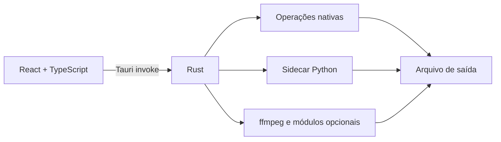

# CAMPS-UTILS

Suíte desktop para Windows com ferramentas locais para documentos, imagens, áudio, vídeo e utilitários do dia a dia.

O projeto começou como **PDF to Markdown** e evoluiu para uma aplicação multiferramenta. A maior parte do processamento acontece no computador do usuário, sem enviar arquivos para serviços de conversão externos.

**Versão atual:** 1.0.1

**Plataforma:** Windows 10/11

**Stack:** Tauri 2 · React 18 · TypeScript · Vite · Tailwind CSS · Rust · Python · PyInstaller

## Funcionalidades

### Documentos

- PDF → Markdown com Docling e OCR
- Markdown → PDF
- Word (`.docx`) → PDF sem exigir Microsoft Word
- Visualizar, juntar, dividir, extrair páginas e comprimir PDFs

### Imagens

- Converter imagens entre WebP, PNG, JPG e ICO
- Redimensionar e renomear imagens em lote
- Comprimir imagens por qualidade ou tamanho-alvo
- Gerar mapas de profundidade com Depth Anything V2

### Mídia

- Gerar legendas SRT/VTT localmente com Whisper
- Gravar legendas em vídeos ou criar faixa desligável
- Baixar áudio, vídeo ou playlists do YouTube
- Comprimir vídeos em H.264
- Converter áudio para MP3, WAV ou FLAC
- Converter trechos de vídeo em GIF

### Utilitários

- Codificar e decodificar Base64
- Gerar QR codes
- Calcular hashes MD5, SHA-1 e SHA-256

## Privacidade e uso da internet

Os arquivos processados não são enviados para APIs de conversão. O aplicativo trabalha localmente por meio do backend Rust, do sidecar Python e de ferramentas como ffmpeg.

A internet é usada apenas quando necessário para:

- baixar vídeos ou áudios solicitados pelo usuário;
- procurar e instalar atualizações do aplicativo;
- baixar módulos opcionais na primeira utilização;
- baixar pesos de modelos de IA local.

## Arquitetura



- **React/TypeScript:** interface, formulários, prévias, histórico e configurações.
- **Tauri/Rust:** janela desktop, diálogos, filesystem, processos, downloads e operações nativas.
- **Python:** Docling, OCR, documentos, PDFs, transcrição e depth map.
- **ffmpeg:** vídeo, áudio, GIF, download e processamento de legendas.
- **localStorage:** configurações e histórico local.

As ferramentas são registradas em `src/tools/registry.tsx`, fonte única para a Home e a Sidebar.

## Pré-requisitos para desenvolvimento

| Ferramenta | Requisito |
|---|---|
| Node.js | 18 ou superior |
| Rust/Cargo | 1.77 ou superior, toolchain MSVC |
| Python | 3.11 ou superior |
| Visual Studio Build Tools | 2022, com desenvolvimento para desktop em C++ |
| WebView2 | normalmente já incluído no Windows 10/11 |

Instalação do Rust e das Build Tools pelo `winget`:

```powershell
winget install Rustlang.Rustup
winget install Microsoft.VisualStudio.2022.BuildTools
```

Depois de instalar o Rust, feche e abra novamente o terminal.

## Configuração do ambiente

### Setup automático

```powershell
# Prepara o ambiente e gera o instalador
npm run setup

# Prepara o ambiente e inicia em modo de desenvolvimento
npm run setup:dev
```

O processo é controlado por `scripts/setup.ps1`.

### Setup manual

```powershell
npm install

python -m venv .venv
.venv\Scripts\Activate.ps1

pip install -r python\requirements.txt
```

As dependências Python e os modelos de IA são pesados. Reserve alguns gigabytes e espere uma instalação inicial mais demorada.

## Desenvolvimento

```powershell
# Aplicativo completo: Vite + Tauri/Rust
npm run dev

# Apenas a interface web
npm run dev:vite
```

O servidor Vite usa obrigatoriamente a porta **1420**, configurada no Tauri.

`npm run dev:vite` é útil para trabalhar apenas na interface. Diálogos, filesystem, processos e chamadas `invoke()` dependentes do Tauri não funcionarão nesse modo.

## Testes e verificações

```powershell
# TypeScript
npm run typecheck

# Frontend
npm test
npm run test:watch

# Um teste específico
npx vitest run src/test/App.test.tsx

# Python
.venv\Scripts\python -m pytest python -v

# Rust
cargo check --manifest-path src-tauri/Cargo.toml
cargo test --manifest-path src-tauri/Cargo.toml

# Build isolado do frontend
npm run build:vite
```

## Build

```powershell
# Compila o sidecar e os módulos Python
npm run build:python

# Gera o aplicativo Tauri e coleta os instaladores
npm run build

# Executa os dois passos anteriores
npm run build:all

# Recopia bundles existentes para installers/
npm run installers
```

Os artefatos finais são copiados para `installers/`. O usuário do aplicativo instalado não precisa ter Node.js, Rust ou Python.

### Módulos Python específicos

```powershell
python python/build.py docling
python python/build.py ffmpeg
python python/build.py whisper
python python/build.py depth
```

O PyInstaller segue imports indiretos, inclusive imports dentro de funções. Depois de gerar um módulo, confira o tamanho do ZIP e execute o binário empacotado fora da `.venv` para detectar dependências ausentes ou incorporadas por engano.

## Módulos baixados sob demanda

Recursos grandes ficam fora do instalador principal. No primeiro uso, o aplicativo baixa o módulo, verifica seu SHA256 e o extrai no diretório local da aplicação.

| Módulo | Recurso | Release |
|---|---|---|
| Docling | PDF → Markdown e OCR | `docling-v1` |
| ffmpeg/ffprobe | ferramentas de mídia | `ffmpeg-v1` |
| Whisper | transcrição e legendas | `whisper-v1` |
| Depth Anything V2 | mapas de profundidade | `depth-v1` |

As URLs, hashes e arquivos marcadores são definidos como `RemoteModule` em `src-tauri/src/commands.rs`.

Docling e Whisper também podem baixar pesos para `~/.cache/huggingface/hub`. O Depth usa `~/.cache/camps-utils/models/`.

## Como adicionar uma ferramenta

### Frontend

1. Crie `src/tools/<id>/<NomeTool>.tsx`.
2. Reutilize os componentes de `src/components/ui/` e os hooks existentes.
3. Registre a ferramenta em `src/tools/registry.tsx`.
4. Adicione o wrapper de backend em `src/services/conversionService.ts`, se necessário.
5. Adicione testes em `src/test/`.

Não é necessário cadastrar a ferramenta separadamente na Home e na Sidebar: ambas usam o registro central.

### Comando Rust

1. Implemente o comando em `src-tauri/src/commands.rs`.
2. Registre-o no `generate_handler!` de `src-tauri/src/lib.rs`.
3. Crie um wrapper `invoke()` tipado no frontend.
4. Revise as permissões em `src-tauri/capabilities/`.

### Operação Python

1. Implemente a função em `python/converter.py` ou em um módulo especializado.
2. Registre a operação em `dispatch(tool, data)`.
3. Preserve o contrato JSON de sucesso e erro.
4. Atualize `python/build.py` e os testes.

> **Contrato crítico:** o sidecar Python deve imprimir somente o JSON final em `stdout`. Todos os logs devem usar `log()`, que escreve em `stderr`. Um `print()` extra pode quebrar o `JSON.parse` no frontend.

## Estrutura do repositório

```text
├── src/
│   ├── components/              # componentes compartilhados e UI
│   ├── hooks/                   # hooks de conversão, histórico e progresso
│   ├── services/                # integração com comandos Tauri
│   ├── tools/                   # componentes de cada ferramenta
│   ├── types/                   # contratos e estado TypeScript
│   └── test/                    # testes do frontend
├── src-tauri/
│   ├── src/commands.rs          # backend nativo e módulos remotos
│   ├── src/lib.rs               # plugins e registro de comandos
│   ├── capabilities/            # permissões Tauri
│   └── tauri.conf.json          # janela, CSP, bundle e updater
├── python/
│   ├── converter.py             # dispatcher e conversões
│   ├── subtitles.py             # processamento de legendas
│   ├── depth.py                 # geração de depth map
│   └── build.py                 # empacotamento PyInstaller
├── scripts/                     # setup, versão, instaladores e release
├── roadmaps/                    # estado e próximas entregas
├── spec/                        # especificações do produto
├── installers/                  # artefatos de distribuição
├── RESUME.md                    # documentação detalhada para Obsidian
└── VERSION                      # versão canônica
```

## Versionamento e release

`VERSION` é a versão canônica. Estes arquivos devem permanecer sincronizados:

- `VERSION`
- `package.json`
- `src-tauri/Cargo.toml`
- `src-tauri/tauri.conf.json`

```powershell
npm run version:check
npm run version:sync
```

Para um build assinado, defina no terminal:

```powershell
$env:TAURI_SIGNING_PRIVATE_KEY = Get-Content "$env:USERPROFILE\.tauri\camps-utils.key" -Raw
$env:TAURI_SIGNING_PRIVATE_KEY_PASSWORD = "<senha>"
```

Depois:

```powershell
npm run build
npm run release
```

`npm run release` gera `installers/latest.json`, usado pelo updater automático.

Anexe ao GitHub Release da versão:

- o instalador `*-setup.exe`;
- a assinatura `.sig` correspondente;
- `latest.json`.

Nunca adicione a chave privada ou sua senha ao repositório. Perder a chave impede novas atualizações para quem já instalou o aplicativo.

### Regra dos GitHub Releases

- Versões do aplicativo, como `v1.0.1`, devem ser releases normais.
- Depósitos de módulos, como `ffmpeg-v1`, devem ser marcados como **pre-release**.

O endpoint do updater usa `releases/latest/download/latest.json`. Um depósito publicado como release normal pode virar o `latest` e interromper as atualizações.

## Pontos importantes

- O estado do frontend usa `useReducer`; não há Redux.
- Configurações e histórico ficam em `localStorage`.
- O progresso do Docling é simulado; algumas ferramentas de mídia têm progresso real.
- O evento `tool-progress` pertence à janela e deve ser consumido pelo hook compartilhado.
- A prévia HTML de legendas aproxima o resultado do libass, mas não é pixel a pixel.
- A CSP de produção não é reproduzida integralmente em `tauri dev`; execute o teste `src/test/csp.test.ts` e valide builds empacotados.
- `installers/` preserva versões antigas; confira o arquivo antes de publicar.
- Partes do código ainda usam nomes legados de `pdf-to-markdown` por compatibilidade.

## Roadmaps

- `roadmaps/new-functions/roadmap.md`: evolução da suíte, módulos e updater.
- `roadmaps/removebg-vtracer-realesrgan/roadmap.md`: prioridade atual — VTracer, Real-ESRGAN e remoção de fundo.
- `roadmaps/ia-local/roadmap.md`: fase de IA local em espera.
- `spec/novas-funcoes/camps-utils-spec.md`: especificação formal da suíte.

Antes de iniciar uma implementação, leia `CLAUDE.md`, este README e o roadmap da fase correspondente. Registre no roadmap o que foi concluído e os próximos passos.

## Solução de problemas

### Porta 1420 ocupada

O Vite usa `strictPort`. Encerre o processo que está usando a porta 1420 e execute novamente `npm run dev`.

### `link.exe` não encontrado

Instale o Visual Studio Build Tools 2022 com o workload de desenvolvimento para desktop em C++.

### Sidecar ou módulo não encontrado

Ative a `.venv` e recompile o alvo:

```powershell
.venv\Scripts\Activate.ps1
npm run build:python
```

### Conversão funciona na `.venv`, mas falha no instalador

Provavelmente há uma dependência ausente no bundle PyInstaller. Execute diretamente o `.exe` gerado e revise inclusões, `hiddenimports` e exclusões em `python/build.py`.

### Primeira execução lenta

É esperado durante o download e a inicialização dos módulos ou pesos de modelos. As execuções seguintes reutilizam o cache.

### WebView2 ausente

Instale o [Microsoft Edge WebView2 Runtime](https://developer.microsoft.com/microsoft-edge/webview2/).

## Documentação adicional

- [`RESUME.md`](RESUME.md): visão técnica detalhada em formato Obsidian.
- [`CLAUDE.md`](CLAUDE.md): contexto de manutenção, contratos e armadilhas.
- [`roadmaps/`](roadmaps/): planejamento vivo do produto.
- [`spec/`](spec/): especificações formais.
