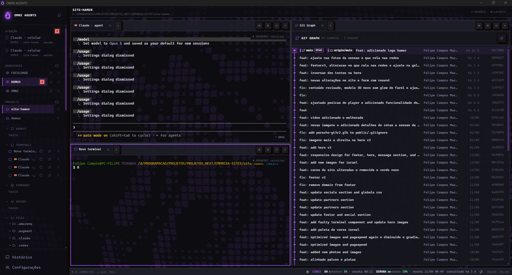
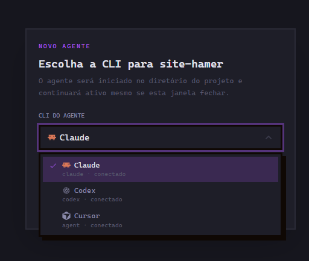
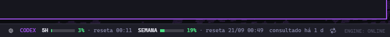
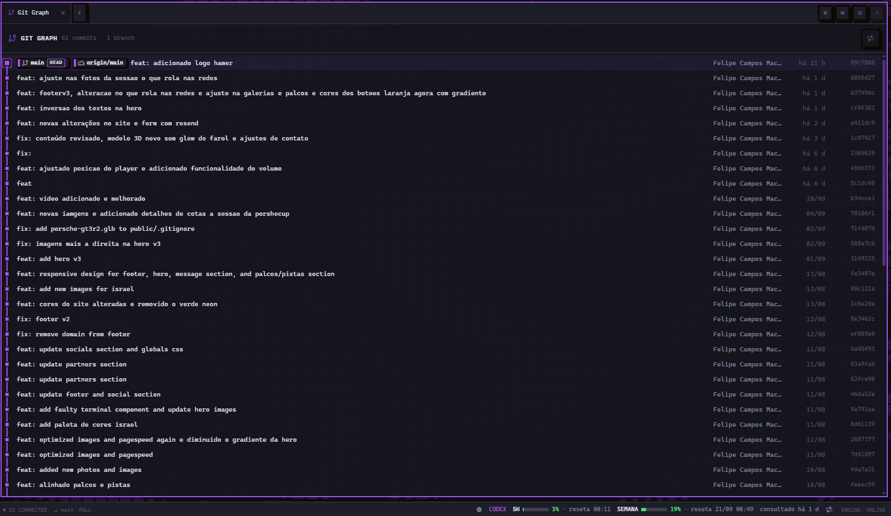
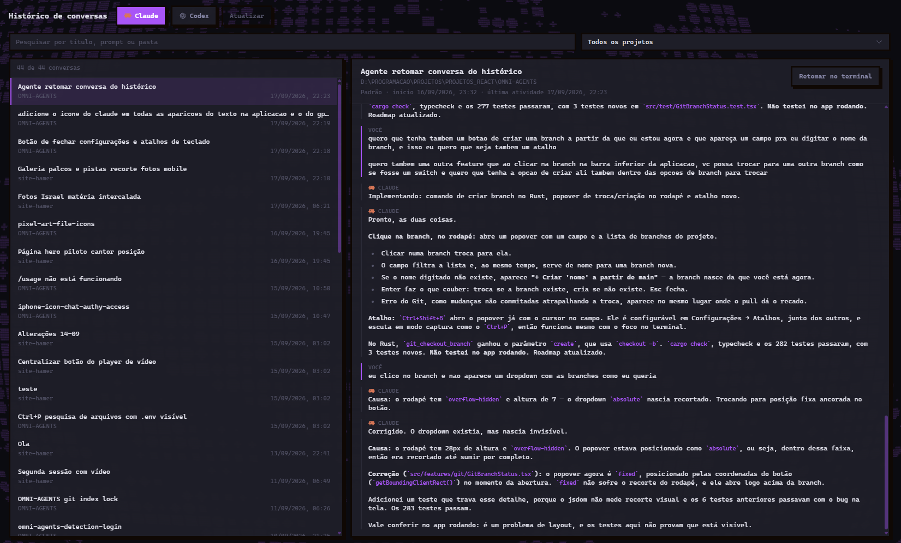
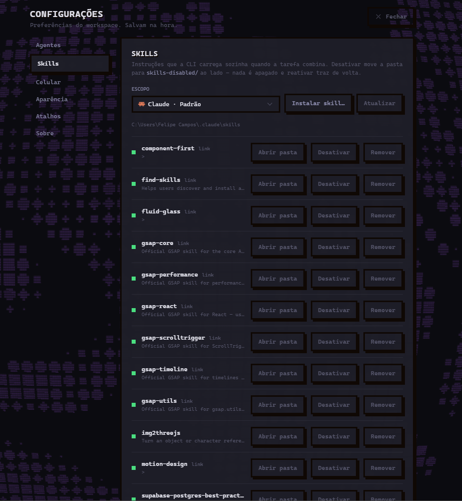
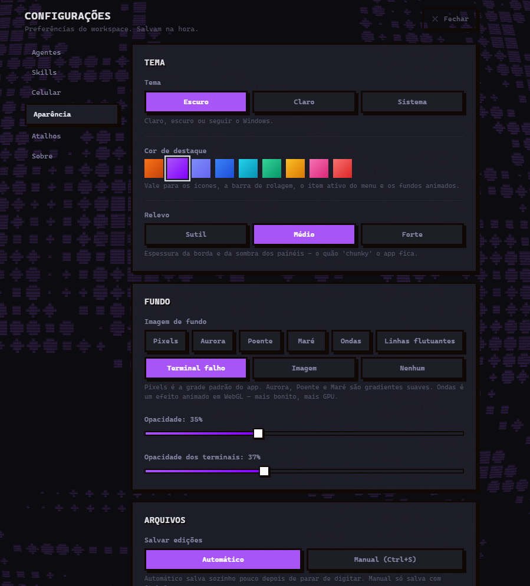
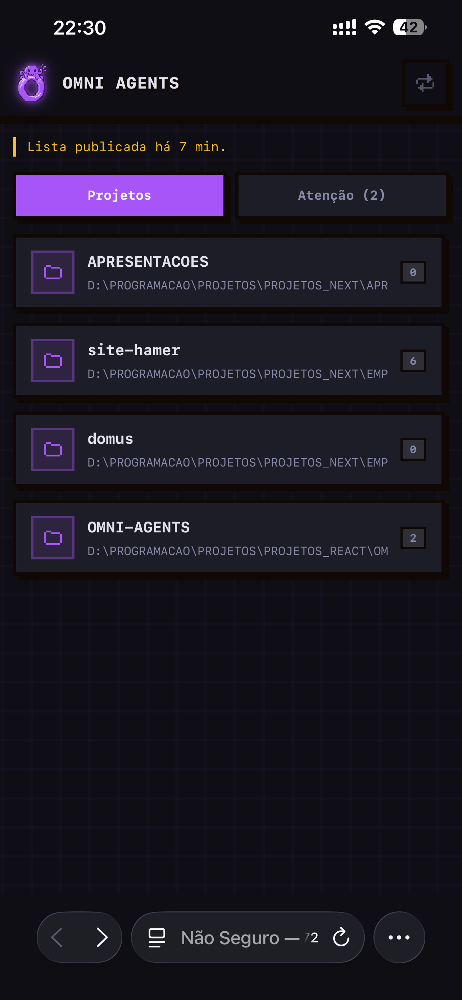
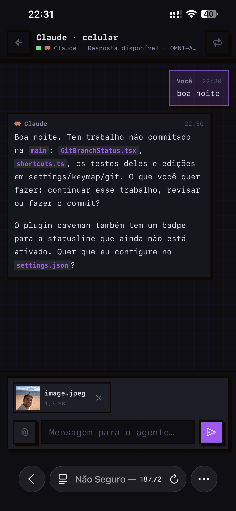
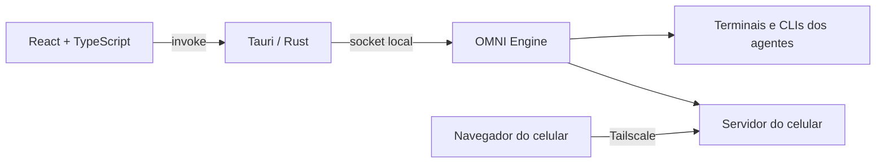

# OMNI AGENTS

Um lugar só para trabalhar com vários agentes de programação ao mesmo tempo — Claude Code, Codex e
Cursor — em vários projetos, sem ficar caçando janelas de terminal.

Os agentes continuam rodando mesmo com a janela fechada, avisam quando terminam ou precisam de
aprovação, e você pode responder a eles **do celular**, de qualquer lugar.

**Versão atual:** 0.5.0 · **Windows, macOS e Linux** · Tauri 2 · React · TypeScript · Rust



---

## O que ele faz

**Vários agentes lado a lado.** Divida a tela em quantos painéis quiser, com um agente ou um
terminal em cada um. Arraste abas entre os painéis. Cada aba mostra a marca do agente que está
rodando nela.

**Nada se perde quando você fecha a janela.** Um serviço próprio segura as sessões: fechar o app,
atualizar o OMNI ou reiniciar a janela não derruba o que o agente está fazendo.

**Avisa quando precisa de você.** O agente terminou o turno ou abriu um pedido de aprovação? O
projeto acende na barra lateral e você recebe uma notificação do sistema. `Ctrl+Tab` pula direto
para quem está esperando, e o **X** do aviso dispensa sem precisar abrir.

**Várias contas por agente.** Pessoal e trabalho no mesmo app, cada uma isolada na própria pasta de
configuração. O OMNI nunca lê nem guarda suas credenciais — o login acontece no próprio provider.

**Mostra quanto você já usou.** A barra de baixo traz o consumo da conta em foco (5 horas e semana),
com barra colorida, mais o modelo e o nível de esforço que está atendendo aquela conversa.

**Histórico de verdade.** Encontre e retome conversas antigas do Claude e do Codex, mesmo as que não
começaram aqui — o OMNI lê os registros das próprias CLIs.

**Git integrado.** Status, stage, commit e push na barra lateral, diferenças lado a lado e um grafo
de commits com ramos, etiquetas e autor. A branch atual fica no rodapé: um clique troca de branch,
cria uma nova ou puxa as mudanças do remoto.

**Projetos no WSL e em servidores.** Abra uma pasta dentro do WSL ou de um servidor por SSH. O
agente continua sendo o do seu PC (mesma conta, histórico e celular), mas os comandos dele e o Git
rodam lá, onde o código está. A tela de abrir projeto lista os recentes.

**Containers Docker.** A seção DOCKER da barra lateral lista os containers do seu computador,
agrupados por projeto do Compose, como a extensão Containers do VS Code: iniciar, parar, reiniciar,
remover, ver os logs e abrir um shell dentro do container, cada um num terminal do app.

**Skills, arquivos e tarefas.** Instale, ative e desative skills por conta ou por projeto, navegue e
edite arquivos do projeto e organize tarefas num quadro Kanban.

**Do celular.** Leia o QR, e o telefone vira um chat com os mesmos agentes: mandar prompt, aprovar
uma ação, anexar arquivos e colar prints. A conexão é direta com o seu PC, pelo Tailscale.

---

## Como é

### Escolher o agente e a conta


### Uso da conta, modelo e esforço


### Git Graph


### Histórico de conversas


### Skills


### Aparência


### No celular
<p>
  
  
</p>

---

## Instalação

Baixe na [página de releases](https://github.com/FelipeCamposM/OMNI-AGENTS/releases/latest):

| Sistema | Arquivo | Observação |
|---|---|---|
| Windows 10/11 | `OMNI.AGENTS_x64-setup.exe` | O SmartScreen pode avisar na primeira vez: **Mais informações → Executar assim mesmo**. |
| macOS (Intel e Apple Silicon) | `OMNI.AGENTS_universal.dmg` | Na primeira abertura, clique com o botão direito no app → **Abrir**. |
| Linux | `.AppImage`, `.deb` ou `.rpm` | O AppImage se atualiza sozinho; `.deb` e `.rpm` precisam reinstalar. |

O app se **atualiza sozinho**: quando sai uma versão nova, aparece um aviso dentro dele.

### O que você precisa ter instalado

O OMNI não traz os agentes dentro dele — ele usa as CLIs que já estão no seu computador:

- [Claude Code](https://claude.com/claude-code) (`claude`)
- [Codex CLI](https://developers.openai.com/codex/cli) (`codex`)
- [Cursor CLI](https://cursor.com/cli) (`agent`)

Basta ter pelo menos uma. Em **Configurações → Agentes** o app mostra quais encontrou e se já têm
login. Para o acesso pelo celular, também é preciso o [Tailscale](https://tailscale.com) no PC e no
telefone, com a mesma conta.

---

## Primeiros passos

1. **Adicione um projeto** pela barra lateral — é uma pasta do seu computador.
2. Clique em **Novo agente**, escolha a CLI e a conta. O agente abre já dentro da pasta do projeto.
3. Divida a tela com `Ctrl+\` e abra outro agente ou um terminal no painel novo.
4. Trabalhe normalmente. Pode fechar a janela: o agente continua.
5. Para usar do celular, vá em **Configurações → Celular** e siga os quatro passos da tela.

---

## Atalhos

Todos podem ser trocados em **Configurações → Atalhos**.

| Atalho | O que faz |
|---|---|
| `Ctrl+P` | Buscar arquivo no projeto |
| `Ctrl+\` | Dividir o painel lado a lado |
| `Ctrl+Shift+\|` | Dividir em cima e embaixo |
| `Ctrl+W` | Fechar o painel |
| `Ctrl+M` | Maximizar o painel |
| `Ctrl+Tab` | Ir para o agente que está pedindo atenção |
| `Ctrl+Shift+B` | Criar uma branch a partir da atual |
| `Ctrl+Shift+Espaço` | Sair do terminal e devolver o teclado ao app |
| `Esc` | Fechar as Configurações e voltar para onde você estava |
| Botão do meio do mouse | Fechar a aba |

---

## Privacidade

- Seus projetos, conversas e configurações **ficam no seu computador**. O OMNI não tem servidor, não
  tem conta e não manda nada para lugar nenhum.
- As credenciais dos agentes continuam sendo do provider: o login abre a própria CLI, e o OMNI
  guarda apenas o nome da conta e a pasta de configuração dela.
- O acesso pelo celular é **direto com o seu PC**, pela rede privada do Tailscale, protegido por um
  código de acesso que fica no telefone e pode ser trocado a qualquer momento.
- A internet é usada para: falar com os provedores dos agentes (isso é a própria CLI), procurar
  atualizações do OMNI e, se você ligar, o acesso pelo celular.

---

## Desenvolvimento

Precisa de Node 18+, Rust e as ferramentas de build do sistema.

```bash
npm install
npm run dev          # app completo (compila o engine e abre a janela)
npm run dev:vite     # só a interface, sem Rust
npm run typecheck
npm test             # testes da interface
cargo test -p omni-engine -p omni-core -p omni-protocol
npm run build        # instalador local
```

### Arquitetura



- **Interface (React):** painéis, abas, editor, git, histórico e configurações.
- **Tauri/Rust:** janela, diálogos, arquivos, perfis de conta e atualizações.
- **OMNI Engine:** processo próprio que segura as sessões e sobrevive ao fechamento da janela; é
  ele que serve a página do celular.

Documentos: [`spec.md`](spec.md) (produto e arquitetura),
[`docs/multiplataforma.md`](docs/multiplataforma.md) (build e release nos três sistemas),
[`docs/mobile-and-account-usage.md`](docs/mobile-and-account-usage.md) (celular e uso de conta),
[`roadmaps/omni-agents/roadmap.md`](roadmaps/omni-agents/roadmap.md) (histórico de decisões).
