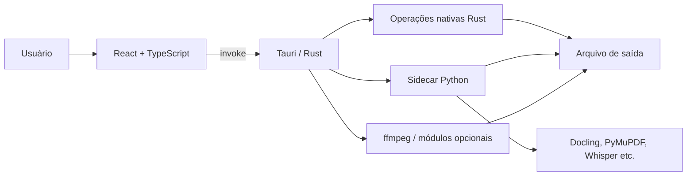

---
aliases:
  - CAMPS-UTILS
  - PDF to Markdown
tags:
  - projeto
  - desktop
  - tauri
  - react
  - rust
  - python
  - conversores
status: em-desenvolvimento
versao: 1.0.1
plataforma: Windows
atualizado: 2026-08-13
---

# CAMPS-UTILS — resumo do projeto

> [!abstract] Em uma frase
> **CAMPS-UTILS** é uma suíte desktop para Windows que reúne conversores e utilitários de documentos, imagens e mídia, executando o processamento localmente por meio de uma interface em React, um backend nativo em Rust/Tauri e módulos pesados em Python.

> [!warning] Nome antigo do repositório
> O projeto nasceu como **PDF to Markdown**, por isso a pasta, alguns nomes internos e partes do `README.md` ainda usam esse nome. O produto atual é **CAMPS-UTILS**, versão **1.0.1**, e já não é um aplicativo de função única.

## Visão geral

- **Produto:** aplicativo desktop instalável para Windows.
- **Objetivo:** concentrar tarefas comuns de conversão e manipulação de arquivos em uma interface única.
- **Privacidade:** o processamento é local. As exceções de rede são downloads solicitados pelo usuário, atualizações, módulos opcionais e pesos de modelos.
- **Interface:** português do Brasil (`pt-BR`).
- **Arquitetura:** frontend React → comandos Tauri/Rust → Python ou ferramentas nativas, conforme a operação.
- **Distribuição:** instalador Tauri; o usuário final não precisa instalar Node.js, Rust ou Python.
- **Atualização:** automática e assinada, via GitHub Releases e plugin updater do Tauri.

## Ferramentas disponíveis

O registro central está em `src/tools/registry.tsx`. Ele é a fonte única para a Home, a Sidebar e o roteamento das ferramentas.

### Documentos

1. **PDF → Markdown:** extrai conteúdo com Docling e OCR.
2. **Markdown → PDF:** converte arquivo `.md` ou texto colado para PDF.
3. **Word → PDF:** converte `.docx` sem exigir Microsoft Word.
4. **Ferramentas de PDF:** visualizar páginas, juntar, dividir, extrair páginas e comprimir PDFs.

### Imagens

1. **Converter imagens:** WebP, PNG, JPG e ICO.
2. **Redimensionar imagens:** dimensão máxima ou escala, qualidade, formato e renomeação em lote.
3. **Comprimir imagens:** redução por qualidade ou por tamanho-alvo.
4. **Gerar Depth Map:** estima profundidade e produz mapa em tons de cinza.

### Mídia

1. **Legenda automática:** transcreve vídeo ou áudio localmente e exporta SRT/VTT.
2. **Legendar vídeo:** grava legenda na imagem ou cria faixa desligável, com estilo e prévia.
3. **Baixar do YouTube:** áudio MP3, vídeo MP4 ou playlist.
4. **Comprimir vídeo:** codificação H.264 via ffmpeg.
5. **Converter áudio:** MP3, WAV ou FLAC.
6. **Vídeo → GIF:** gera GIF de um trecho do vídeo.

### Utilitários

1. **Base64 / Texto:** codificação e decodificação inteiramente no frontend.
2. **QR code:** gera PNG a partir de texto ou URL.
3. **Hash / Checksum:** MD5, SHA-1 e SHA-256 de arquivos.

## Como o sistema funciona



### Fluxo React → Rust → Python

O fluxo mais representativo é o PDF → Markdown:

1. A ferramenta React chama um wrapper de `src/services/conversionService.ts`.
2. O wrapper usa `invoke()` para chamar um comando Tauri.
3. O comando registrado em `src-tauri/src/lib.rs` é executado em Rust.
4. Quando necessário, Rust inicia o sidecar Python e passa um JSON por `--input`.
5. `python/converter.py` despacha a operação, processa o arquivo e retorna JSON.
6. O serviço TypeScript interpreta o resultado e a interface atualiza estado, histórico e resultado.

> [!danger] Contrato crítico de stdout/stderr
> O sidecar Python deve imprimir **somente o JSON final em `stdout`**. Logs e progresso devem ir para `stderr` por meio de `log()`. Qualquer `print()` extra em stdout pode quebrar o `JSON.parse` no frontend.

### O que roda em cada camada

| Camada | Responsabilidade principal |
|---|---|
| React/TypeScript | Interface, formulários, seleção de arquivos, prévias, histórico e configurações |
| Tauri/Rust | Janela desktop, diálogos, filesystem, processos, downloads, validação SHA256 e operações nativas |
| Python | Conversões pesadas de documentos, OCR, PDF, transcrição e depth map |
| ffmpeg | Vídeo, áudio, GIF, legendas e apoio ao download de mídia |
| localStorage | Configurações e histórico local do MVP |

## Stack

| Área | Tecnologias |
|---|---|
| Desktop | Tauri 2, WebView2 |
| Frontend | React 18, TypeScript 5, Vite 5 |
| Estilo/UI | Tailwind CSS 3, Lucide React, CSS |
| Animação/visual | GSAP, OGL, Three.js |
| Markdown/PDF no frontend | react-markdown, remark-gfm, rehype-sanitize, pdfjs-dist |
| Backend nativo | Rust 2021, Tokio, Serde, Reqwest |
| Imagens/utilitários nativos | image, webp, qrcode, sha2, sha1, md5 |
| Sidecar | Python 3.11+, PyInstaller |
| Documentos | Docling, RapidOCR/ONNX Runtime, Markdown, xhtml2pdf, Mammoth, PyMuPDF, pikepdf |
| Mídia/IA local | ffmpeg, yt-dlp, faster-whisper, ONNX Runtime, Pillow, NumPy |
| Testes | Vitest, Testing Library, jsdom, pytest, testes Rust |

## Estrutura relevante

```text
PDF-TO-MARKDOWN/
├── src/                         # frontend React/TypeScript
│   ├── components/              # shell, componentes compartilhados e UI
│   ├── hooks/                   # conversão, drag/drop, histórico, settings, progresso
│   ├── services/                # wrappers de invoke, histórico, settings e logs
│   ├── tools/                   # uma pasta por ferramenta
│   │   └── registry.tsx         # registro central de todas as ferramentas
│   ├── types/                   # contratos e estado TypeScript
│   ├── test/                    # testes Vitest/Testing Library
│   └── App.tsx                  # shell e roteamento interno
├── src-tauri/
│   ├── src/commands.rs          # comandos nativos e gerenciamento de módulos
│   ├── src/lib.rs               # plugins e registro dos comandos
│   ├── capabilities/            # permissões Tauri
│   ├── binaries/                # sidecar leve empacotado
│   ├── Cargo.toml
│   └── tauri.conf.json          # janela, bundle, CSP e updater
├── python/
│   ├── converter.py             # dispatcher e conversões Python
│   ├── subtitles.py             # processamento e estilo de legendas
│   ├── depth.py                 # inferência de profundidade
│   ├── build.py                 # builds PyInstaller e módulos remotos
│   ├── requirements.txt
│   └── test_*.py
├── scripts/                     # setup, versão, instaladores e release
├── assets/fonts/                # fontes usadas em legendas
├── installers/                  # instaladores e artefatos coletados
├── roadmaps/                    # estado e próximas entregas
├── spec/                        # especificações formais
├── package.json
├── README.md
└── VERSION
```

## Pré-requisitos para desenvolver

| Ferramenta | Versão/requisito |
|---|---|
| Windows | Windows 10/11 recomendado |
| Node.js | 18 ou superior |
| Rust/Cargo | 1.77 ou superior, toolchain MSVC |
| Python | 3.11 ou superior |
| Visual Studio Build Tools | 2022, workload “Desenvolvimento para desktop com C++” |
| WebView2 | normalmente já presente no Windows 10/11 |

> [!note] Dependências pesadas
> A instalação Python e os módulos de IA podem ocupar vários gigabytes. A primeira execução de alguns recursos também baixa pesos de modelos.

## Setup

### Automático

```powershell
# Prepara dependências e gera o instalador
npm run setup

# Prepara o ambiente e inicia em desenvolvimento
npm run setup:dev
```

O script principal é `scripts/setup.ps1`.

### Manual

```powershell
npm install
python -m venv .venv
.venv\Scripts\Activate.ps1
pip install -r python\requirements.txt
```

Para instalar Rust e Build Tools, se necessário:

```powershell
winget install Rustlang.Rustup
winget install Microsoft.VisualStudio.2022.BuildTools
```

## Comandos de desenvolvimento

```powershell
# Aplicativo completo: Vite + Tauri/Rust
npm run dev

# Apenas a interface web; invokes nativos falharão
npm run dev:vite

# Verificação de tipos
npm run typecheck

# Testes frontend
npm test
npm run test:watch

# Um arquivo de teste específico
npx vitest run src/test/App.test.tsx

# Testes Python
.venv\Scripts\python -m pytest python/test_converter.py python/test_subtitles.py -v

# Verificação Rust
cargo check --manifest-path src-tauri/Cargo.toml

# Testes Rust
cargo test --manifest-path src-tauri/Cargo.toml
```

> [!tip] Desenvolvimento somente de UI
> Use `npm run dev:vite` quando não precisar testar diálogos, filesystem, processos ou conversões nativas. O servidor Vite usa obrigatoriamente a porta **1420** porque o Tauri espera `http://localhost:1420`.

## Build e distribuição

```powershell
# Compila o sidecar/módulos Python
npm run build:python

# Build Tauri e coleta instaladores em installers/
npm run build

# Sidecar Python + aplicativo
npm run build:all

# Apenas recopiar bundles já gerados
npm run installers

# Build web isolado
npm run build:vite

# Gerar latest.json para uma release assinada
npm run release
```

O build Python também aceita alvos específicos diretamente:

```powershell
python python/build.py docling
python python/build.py ffmpeg
python python/build.py whisper
python python/build.py depth
```

O Tauri usa `externalBin: ["binaries/converter"]`. O nome final do executável segue a convenção de sidecar do Tauri, com o target triple `x86_64-pc-windows-msvc`.

## Versionamento e release

A versão precisa ficar sincronizada nestes quatro locais:

- `VERSION`
- `package.json`
- `src-tauri/Cargo.toml`
- `src-tauri/tauri.conf.json`

```powershell
npm run version:check
npm run version:sync
```

### Checklist de release

- [ ] Atualizar `VERSION` e sincronizar os demais arquivos.
- [ ] Executar `npm run version:check`.
- [ ] Executar `npm run typecheck`.
- [ ] Executar `npm test`.
- [ ] Executar os testes Python.
- [ ] Executar `cargo check` ou `cargo test`.
- [ ] Definir as variáveis de assinatura do updater.
- [ ] Executar `npm run build` ou `npm run build:all`.
- [ ] Executar `npm run release`.
- [ ] Publicar instalador, assinatura e `latest.json` no GitHub Release `v<versão>`.
- [ ] Atualizar o roadmap correspondente.

Variáveis exigidas no terminal do build assinado:

```powershell
$env:TAURI_SIGNING_PRIVATE_KEY = Get-Content "$env:USERPROFILE\.tauri\camps-utils.key" -Raw
$env:TAURI_SIGNING_PRIVATE_KEY_PASSWORD = "<senha>"
```

> [!danger] Chave do updater
> A chave privada e a senha nunca devem entrar no repositório. Perder essa chave impede atualizar remotamente as instalações existentes, pois a chave pública já está gravada nos binários distribuídos.

## Atualizador automático

1. O aplicativo consulta `releases/latest/download/latest.json` no repositório GitHub.
2. Compara a versão publicada com a instalada.
3. Baixa o instalador indicado no manifesto.
4. Valida a assinatura com a chave pública embutida.
5. Só instala se a assinatura for válida.

> [!important] Regra dos GitHub Releases
> Releases do aplicativo (`v1.0.1`, por exemplo) devem ser normais. Releases usadas apenas como depósito de módulos (`docling-v1`, `ffmpeg-v1` etc.) devem ser marcadas como **pre-release**. Caso contrário, um depósito pode virar o `latest` do GitHub e quebrar a busca de `latest.json`.

## Módulos baixados sob demanda

Bibliotecas grandes não ficam no instalador principal. O `ModuleGate` detecta a necessidade, e o Rust baixa um ZIP, verifica SHA256 e extrai em `appLocalData/runtime/`.

| Módulo | Usado por | Release | Marker |
|---|---|---|---|
| Docling | PDF → Markdown | `docling-v1` | `converter-docling-x86_64-pc-windows-msvc.exe` |
| ffmpeg/ffprobe | ferramentas de mídia | `ffmpeg-v1` | `ffmpeg.exe` |
| Whisper | legenda automática | `whisper-v1` | `converter-whisper-x86_64-pc-windows-msvc.exe` |
| Depth Anything V2 | depth map | `depth-v1` | `converter-depth-x86_64-pc-windows-msvc.exe` |

As definições, URLs, hashes e markers ficam em `src-tauri/src/commands.rs` como `RemoteModule`.

> [!warning] Atualizar um módulo
> Ao trocar seu conteúdo, crie nova tag/ZIP, atualize `url` e `sha256` e, quando necessário, versione também o marker. Se o marker antigo continuar existindo, o aplicativo pode considerar o módulo antigo já instalado.

### Pesos de modelos

- Docling e Whisper podem usar o cache da Hugging Face em `~/.cache/huggingface/hub`.
- Depth guarda modelos em `~/.cache/camps-utils/models/`.
- O ZIP remoto contém principalmente o runtime; alguns pesos continuam sendo baixados no primeiro uso.
- A primeira execução pode ser lenta e exigir internet.

## Padrões para programar novas ferramentas

### Nova ferramenta de frontend

1. Criar `src/tools/<id>/<NomeTool>.tsx`.
2. Reutilizar componentes de `src/components/ui/` e hooks existentes.
3. Registrar a ferramenta em `src/tools/registry.tsx`.
4. Se houver backend, adicionar wrapper tipado em `src/services/conversionService.ts`.
5. Adicionar testes em `src/test/`.

Não edite Home e Sidebar separadamente para cadastrar uma ferramenta: ambas derivam do registro central.

### Nova capacidade Rust

1. Implementar função em `src-tauri/src/commands.rs` com `#[tauri::command]`.
2. Registrar em `tauri::generate_handler![]` dentro de `src-tauri/src/lib.rs`.
3. Criar wrapper `invoke()` no serviço TypeScript.
4. Revisar permissões em `src-tauri/capabilities/`.
5. Cobrir serialização, erros e caminho feliz com testes.

### Nova operação Python

1. Implementar função em `python/converter.py` ou módulo especializado.
2. Adicionar a chave ao `dispatch(tool, data)`.
3. Manter o contrato JSON de sucesso/erro.
4. Usar `log()` para stderr; nunca emitir logs em stdout.
5. Atualizar `python/build.py` para inclusões/exclusões do PyInstaller.
6. Executar o `.exe` empacotado em um smoke test; funcionar na `.venv` não prova que o bundle contém todas as dependências.

> [!warning] PyInstaller e imports indiretos
> O PyInstaller segue imports mesmo quando estão dentro de funções. Ao criar um módulo remoto, exclua explicitamente as pilhas pesadas dos outros módulos para evitar bundles enormes e dependências acidentais.

## Estado e persistência

- O estado principal usa `useReducer`, com união discriminada em `src/types/conversion.ts`.
- Não há Redux nem store global externa.
- Configurações: `localStorage`, chave `camps-utils-settings`, com fallback legado.
- Histórico: `localStorage`, chave `pdf-to-markdown-history`, limitado por `historyLimit`.
- Arquivos finais são gravados por comandos Rust, não pelo localStorage.
- O progresso da conversão Docling é cosmético, baseado em intervalo; não representa progresso real.
- Algumas ferramentas de mídia emitem progresso real pelo evento `tool-progress`.

> [!warning] Evento global de progresso
> `tool-progress` pertence à janela. Evite múltiplos listeners ativos reagindo ao mesmo evento; reutilize `useToolProgress` e o padrão já existente.

## Segurança e privacidade

- Arquivos do usuário não são enviados a APIs de conversão.
- Downloads remotos usam HTTPS e módulos são conferidos por SHA256.
- Atualizações do aplicativo são verificadas por assinatura.
- Markdown renderizado usa `rehype-sanitize`.
- A CSP de produção está em `src-tauri/tauri.conf.json`.

> [!warning] CSP não aparece corretamente em dev
> A CSP do Tauri é aplicada pelo handler de assets no build empacotado; `tauri dev` serve o frontend pelo Vite. Mudanças em visualização de arquivos locais devem manter `asset:`, `http://asset.localhost` e `https://asset.localhost` liberados em `img-src`, `media-src` e, quando aplicável, `connect-src`. O teste `src/test/csp.test.ts` protege esse contrato.

## Testes e validação recomendados

Antes de considerar uma mudança pronta:

```powershell
npm run version:check
npm run typecheck
npm test
.venv\Scripts\python -m pytest python -v
cargo test --manifest-path src-tauri/Cargo.toml
npm run build:vite
```

Para alterações no sidecar ou módulos:

- [ ] Recompilar o alvo afetado.
- [ ] Executar o binário empacotado fora da `.venv`.
- [ ] Validar que stdout contém apenas o JSON esperado.
- [ ] Conferir tamanho do bundle para detectar dependências arrastadas.
- [ ] Testar arquivo válido, inválido, ausente e protegido/corrompido quando aplicável.

Para alterações visuais/nativas:

- [ ] Testar `npm run dev` em uma janela Tauri real.
- [ ] Testar o build de produção, sobretudo CSP e asset protocol.
- [ ] Conferir drag-and-drop, diálogos, cancelamento e mensagens de erro.

## Armadilhas conhecidas

- **Nome legado:** alguns identificadores ainda dizem `pdf-to-markdown` embora o produto seja CAMPS-UTILS.
- **UI sem Tauri:** `npm run dev:vite` não executa `invoke()` nativo.
- **Porta fixa:** a porta 1420 precisa estar livre.
- **Primeiro uso lento:** modelos podem ser baixados e inicializados.
- **stdout contaminado:** um log Python pode invalidar toda a resposta JSON.
- **Progresso Docling:** os passos exibidos são simulados.
- **Módulos antigos:** marker sem versão pode impedir atualização do runtime.
- **Bundles grandes:** imports transitivos do PyInstaller podem incorporar Whisper, Torch, AV ou ONNX sem intenção.
- **Fontes de legenda:** `assets/fonts/` pode estar fora do Git; sem ele há fallback silencioso para fontes do Windows.
- **Prévia de legenda:** é aproximação HTML do libass, não reprodução pixel a pixel.
- **Instaladores antigos:** `installers/` não é limpo automaticamente; confira a versão antes do upload.
- **Assinatura Tauri:** o formato do artefato assinado pode variar entre versões; `make-latest-json.mjs` procura formatos conhecidos.

## Limpeza de builds e caches

> [!danger] Comandos destrutivos
> Execute apenas quando souber que não precisa dos artefatos. Os modelos serão baixados novamente se o cache for removido.

```powershell
# Build Rust/Tauri
Remove-Item -Recurse -Force src-tauri\target

# Builds Python
Remove-Item -Recurse -Force python\build, python\dist

# Dependências Node
Remove-Item -Recurse -Force node_modules
npm install

# Cache de modelos Hugging Face
Remove-Item -Recurse -Force "$env:USERPROFILE\.cache\huggingface\hub"
```

## Roadmaps e direção atual

- `roadmaps/new-functions/roadmap.md`: evolução principal da suíte, módulos e updater.
- `roadmaps/removebg-vtracer-realesrgan/roadmap.md`: **prioridade atual** — vetorizar com VTracer, aumentar qualidade com Real-ESRGAN e remover fundo com rembg.
- `roadmaps/ia-local/roadmap.md`: fase de IA local atualmente em espera.
- `spec/novas-funcoes/camps-utils-spec.md`: especificação formal da transformação em suíte.

> [!todo] Próxima decisão técnica importante
> Antes de implementar Real-ESRGAN, escolher entre `realesrgan-ncnn-vulkan` (menor, exige Vulkan) e PyTorch (funciona em CPU, mas adiciona centenas de MB). A decisão muda substancialmente o módulo e o requisito de hardware.

## Arquivos que vale ler primeiro

1. `CLAUDE.md` — contexto técnico, regras de release e armadilhas acumuladas.
2. `src/tools/registry.tsx` — catálogo e metadados das ferramentas.
3. `src/App.tsx` — shell e navegação.
4. `src/services/conversionService.ts` — contrato do frontend com Rust.
5. `src-tauri/src/lib.rs` — superfície de comandos exposta ao frontend.
6. `src-tauri/src/commands.rs` — backend nativo, módulos e processos.
7. `python/converter.py` — dispatcher e operações Python.
8. `python/build.py` — empacotamento dos sidecars.
9. `src-tauri/tauri.conf.json` — bundle, updater, janela e CSP.
10. O roadmap da fase em que a alteração será feita.

## Checklist rápido para retomar o projeto

- [ ] Ler este resumo e o roadmap ativo.
- [ ] Conferir `git status` para não sobrescrever trabalho local.
- [ ] Ativar `.venv` quando mexer no Python.
- [ ] Rodar `npm run version:check`.
- [ ] Usar `npm run dev:vite` para UI pura ou `npm run dev` para integração real.
- [ ] Seguir o fluxo completo entre React, Rust e Python antes de alterar contratos.
- [ ] Atualizar testes e roadmap junto com a implementação.
- [ ] Em release, validar versão, assinatura, nomes dos assets e `latest.json`.

## Referências internas

- [[README]]
- [[CLAUDE]]
- [[roadmap]]
- [[roadmaps/new-functions/roadmap]]
- [[roadmaps/removebg-vtracer-realesrgan/roadmap]]
- [[roadmaps/ia-local/roadmap]]
- [[spec/novas-funcoes/camps-utils-spec]]
